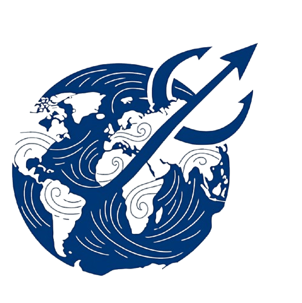
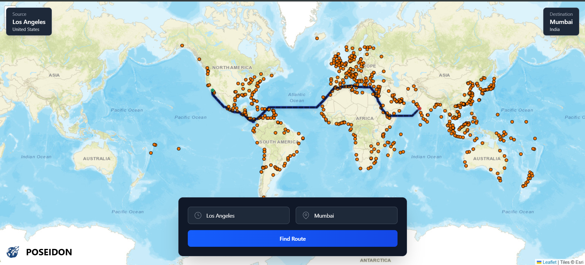

# PoseiDon - The map of the seas🌊

  
  
  PoseiDon is an advanced maritime route optimization system that helps ships find the most efficient navigable paths between ports worldwide. Leveraging bathymetric data and sophisticated pathfinding algorithms, it provides optimal routes while considering water depth, known waterways, and geographical constraints.

 

## Features 🚢

- **Interactive World Map**: Visualize ports and routes on a global map
- **Port Search**: Quickly find source and destination ports
- **Route Visualization**: Animated path display with real-time rendering
- **Depth Optimization**: Finds paths based on vessel draft requirements
- **Waterway Integration**: Incorporates major canals and straits
- **Performance**: Efficient algorithms handle global-scale routing

## How It Works ⚙️

### System Architecture
PoseiDon consists of three main components:

1. **Frontend (React + Leaflet)**: Interactive map interface with port selection
2. **Backend (Node.js/Express)**: API layer for port data and route requests
3. **Routing Engine (Python/Flask)**: Sophisticated pathfinding algorithm processing GEBCO bathymetric data

### Pathfinding Process
1. User selects source and destination ports (e.g., Los Angeles to Mumbai)
2. System retrieves port coordinates from database
3. Routing engine processes bathymetric data with these steps:
   - Creates navigability grid based on depth requirements
   - Incorporates known waterways and straits
   - Finds optimal path using modified A* algorithm
   - Returns coordinate path to frontend
4. Frontend animates the route on the map

## Example Route 🗺️

*Optimal maritime route between Los Angeles and Mumbai*

## Technology Stack 💻

### Frontend
- React 19
- Leaflet.js
- Tailwind CSS
- Vite

### Backend
- Node.js
- Express
- MongoDB

### Routing Engine
- Python
- Flask
- xarray
- scikit-image
- scipy

## Future Enhancements 🔮

- Add vessel-specific routing profiles
- Incorporate weather and current data
- Implement historical route tracking
- Add ETA calculations based on vessel speed
- Include fuel consumption estimates

---

⚓ Smooth sailing with PoseiDon! ⚓
